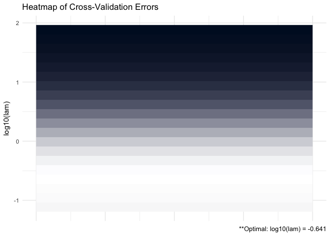
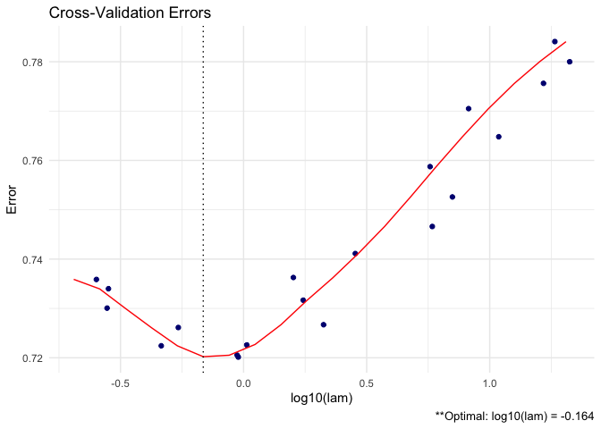

shrink
================

[](https://travis-ci.org/MGallow/shrink)
[](https://cran.r-project.org/package=shrink)

## Overview

`shrink` is an implementation of the methods described in “Shrinking
Characteristics of Precision Matrix Estimators”
[pdf](https://arxiv.org/pdf/1704.04820.pdf). It estimates a penalized
precision matrix via a modified alternating direction method of
multipliers (ADMM)
algorithm.

<p align="center">


</p>

A (possibly incomplete) list of functions contained in the package can
be found below:

  - `shrink()` computes the estimated precision matrix

  - `plot.shrink()` produces a heat map or line graph for cross
    validation errors

See [vignette](https://mgallow.github.io/ADMMsigma/) or
[manual](https://github.com/MGallow/ADMMsigma/blob/master/ADMMsigma.pdf).

## Installation

``` r
# The easiest way to install is from GitHub:
# install.packages("devtools")
devtools::install_github("MGallow/shrink")
```

If there are any issues/bugs, please let me know:
[github](https://github.com/MGallow/shrink/issues). You can also contact
me via my [website](https://mgallow.github.io/). Pull requests are
welcome\!

## Usage

``` r
library(shrink)
set.seed(123)

# let's generate some data!

# specify marginal covariance of X
# note that the inverse is tri-diagonal (sparse)
Sxx = matrix(0.7, nrow = 5, ncol = 5)
for (i in 1:5){
  for (j in 1:5){
    Sxx[i, j] = Sxx[i, j]^abs(i - j)
  }
}

# now randomly generate some 100 observations of X
Z = matrix(rnorm(100*5), nrow = 100, ncol = 5)
out = eigen(Sxx, symmetric = TRUE)
Sxx.sqrt = out$vectors %*% diag(out$values^0.5) %*% t(out$vectors)
X = Z %*% Sxx.sqrt

# randomly generate regression coefficients
betas = matrix(rnorm(5, 0, sqrt(1/5)), nrow = 5, ncol = 1)

# we will also assume a sparse matrix here
betas = betas*matrix(rbinom(5, 1, prob = 0.5), nrow = 5, ncol = 1)

# now we randomly generate Y
Y = X %*% betas + rnorm(100)


# print marginal sample precision matrix for X
# this is perhaps a bad estimate (not sparse)
Sample = (nrow(X) - 1)/nrow(X)*cov(X)
round(qr.solve(Sample), 5)
```

    ##          [,1]     [,2]     [,3]     [,4]     [,5]
    ## [1,]  2.32976 -1.55033  0.22105 -0.08607  0.24309
    ## [2,] -1.55033  3.27561 -1.68026 -0.14277  0.18949
    ## [3,]  0.22105 -1.68026  3.19897 -1.25158 -0.11016
    ## [4,] -0.08607 -0.14277 -1.25158  2.76790 -1.37226
    ## [5,]  0.24309  0.18949 -0.11016 -1.37226  2.05377

``` r
# estimate preicison matrix (omega) assuming sparsity
# note that this is simply lasso penalized preicision matrix
shrink(X, lam = 0.5)
```

    ## Matrix Y not detected... will use loglik for crit.cv instead!

    ## 
    ## Call: shrink(X = X, lam = 0.5)
    ## 
    ## Iterations: 14
    ## 
    ## Tuning parameters:
    ##       log10(lam)  lam
    ## [1,]      -0.301  0.5
    ## 
    ## Log-likelihood: -325.34961
    ## 
    ## Omega:
    ##          [,1]     [,2]     [,3]     [,4]     [,5]
    ## [1,]  0.80258 -0.00363 -0.00002 -0.00003 -0.00001
    ## [2,] -0.00363  0.74592 -0.03755 -0.00002 -0.00004
    ## [3,] -0.00002 -0.03755  0.75451 -0.04662  0.00001
    ## [4,] -0.00003 -0.00002 -0.04662  0.69268 -0.05671
    ## [5,] -0.00001 -0.00004  0.00001 -0.05671  0.71739

``` r
# what if we instead assumed sparsity in beta?
# recall that beta is a product of marginal precision of X and cov(X, Y)
shrink(X, Y, B = cov(X, Y), nlam = 20, lam.max = max(abs(t(X) %*% Y)))
```

    ## 
    ## Call: shrink(X = X, Y = Y, B = cov(X, Y), nlam = 20, lam.max = max(abs(t(X) %*% 
    ##     Y)))
    ## 
    ## Iterations: 25
    ## 
    ## Tuning parameters:
    ##       log10(lam)    lam
    ## [1,]      -0.164  0.686
    ## 
    ## Log-likelihood: -115.58565
    ## 
    ## Omega:
    ##          [,1]     [,2]     [,3]     [,4]     [,5]
    ## [1,]  1.69602 -1.13833  0.19624  0.30270 -0.02760
    ## [2,] -1.13833  2.97473 -1.58959 -0.40033  0.30833
    ## [3,]  0.19624 -1.58959  3.09219 -1.22341 -0.10923
    ## [4,]  0.30270 -0.40033 -1.22341  2.50158 -1.17438
    ## [5,] -0.02760  0.30833 -0.10923 -1.17438  1.98885

``` r
# we could also assume sparsity in beta AND omega
shrink(X, Y, B = cbind(cov(X, Y), diag(ncol(X))), nlam = 20, lam.max = 10, lam.min.ratio = 1e-4)
```

    ## 
    ## Call: shrink(X = X, Y = Y, B = cbind(cov(X, Y), diag(ncol(X))), nlam = 20, 
    ##     lam.max = 10, lam.min.ratio = 1e-04)
    ## 
    ## Iterations: 29
    ## 
    ## Tuning parameters:
    ##       log10(lam)    lam
    ## [1,]      -1.105  0.078
    ## 
    ## Log-likelihood: -171.52139
    ## 
    ## Omega:
    ##          [,1]     [,2]     [,3]     [,4]     [,5]
    ## [1,]  1.54834 -0.70518  0.00008  0.00002  0.01828
    ## [2,] -0.70518  1.84090 -0.76744 -0.08973 -0.00006
    ## [3,]  0.00008 -0.76744  1.90009 -0.69543 -0.02743
    ## [4,]  0.00002 -0.08973 -0.69543  1.70299 -0.72951
    ## [5,]  0.01828 -0.00006 -0.02743 -0.72951  1.42057

``` r
# produce CV heat map for shrink
(shrink = shrink(X, Y, B = cov(X, Y), nlam = 20, lam.max = max(abs(t(X) %*% Y))))
```

    ## 
    ## Call: shrink(X = X, Y = Y, B = cov(X, Y), nlam = 20, lam.max = max(abs(t(X) %*% 
    ##     Y)))
    ## 
    ## Iterations: 25
    ## 
    ## Tuning parameters:
    ##       log10(lam)    lam
    ## [1,]      -0.164  0.686
    ## 
    ## Log-likelihood: -115.58565
    ## 
    ## Omega:
    ##          [,1]     [,2]     [,3]     [,4]     [,5]
    ## [1,]  1.69602 -1.13833  0.19624  0.30270 -0.02760
    ## [2,] -1.13833  2.97473 -1.58959 -0.40033  0.30833
    ## [3,]  0.19624 -1.58959  3.09219 -1.22341 -0.10923
    ## [4,]  0.30270 -0.40033 -1.22341  2.50158 -1.17438
    ## [5,] -0.02760  0.30833 -0.10923 -1.17438  1.98885

``` r
plot(shrink, type = "heatmap")
```

<!-- -->

``` r
# produce line graph for CV errors for shrink
plot(shrink, type = "line")
```

<!-- -->
