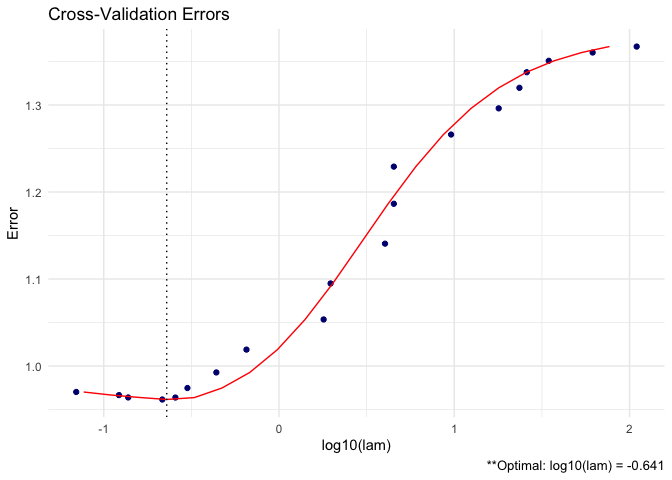

SCPME
================

[](https://travis-ci.org/MGallow/SCPME)
[](https://cran.r-project.org/package=SCPME)

## Overview

`SCPME` is an implementation of the methods described in “Shrinking
Characteristics of Precision Matrix Estimators”
([link](https://doi.org/10.1093/biomet/asy023)). It estimates a
penalized precision matrix via a modified alternating direction method
of multipliers (ADMM)
algorithm.

<p align="center">


</p>

A (possibly incomplete) list of functions contained in the package can
be found below:

  - `shrink()` computes the estimated precision matrix

  - `data_gen()` data generation function (for convenience)

  - `plot.shrink()` produces a heat map or line graph for cross
    validation errors

See package [website](https://mgallow.github.io/SCPME/) or
[manual](https://github.com/MGallow/ADMMsigma/blob/master/SCPME.pdf).

## Installation

``` r
# The easiest way to install is from GitHub: install.packages('devtools')
devtools::install_github("MGallow/shrink")
```

If there are any issues/bugs, please let me know:
[github](https://github.com/MGallow/SCPME/issues). You can also contact
me via my [website](https://mgallow.github.io/). Pull requests are
welcome\!

## Usage

``` r
library(SCPME)
set.seed(123)

# generate data from a sparse oracle precision matrix we can use the
# built-in `data_gen` function

# generate 100 x 5 X data matrix and 100 x 1 Y data matrix
data = data_gen(p = 5, n = 100, r = 1)

# the default regression coefficients are sparse
data$betas
```

    ##             [,1]
    ## [1,] -0.25065233
    ## [2,]  0.00000000
    ## [3,]  0.69707555
    ## [4,]  0.03153231
    ## [5,]  0.00000000

``` r
# default oracle precision matrix is also sparse
round(qr.solve(data$SigmaX), 5)
```

    ##          [,1]     [,2]     [,3]     [,4]     [,5]
    ## [1,]  1.96078 -1.37255  0.00000  0.00000  0.00000
    ## [2,] -1.37255  2.92157 -1.37255  0.00000  0.00000
    ## [3,]  0.00000 -1.37255  2.92157 -1.37255  0.00000
    ## [4,]  0.00000  0.00000 -1.37255  2.92157 -1.37255
    ## [5,]  0.00000  0.00000  0.00000 -1.37255  1.96078

``` r
# now suppose we are interested in estimating the precision

# print marginal sample precision matrix for X this is perhaps a bad
# estimate (not sparse)
sample = (nrow(data$X) - 1)/nrow(data$X) * cov(data$X)
round(qr.solve(sample), 5)
```

    ##          [,1]     [,2]     [,3]     [,4]     [,5]
    ## [1,]  2.20420 -1.24670 -0.12435 -0.02156 -0.20889
    ## [2,] -1.24670  2.39120 -0.90434  0.09653 -0.04804
    ## [3,] -0.12435 -0.90434  2.61482 -1.62774  0.14684
    ## [4,] -0.02156  0.09653 -1.62774  3.38677 -1.75151
    ## [5,] -0.20889 -0.04804  0.14684 -1.75151  2.36464

``` r
# now use SCPME to estimate preicison matrix (omega) assuming sparsity note
# that this is simply a lasso penalized preicision matrix
shrink(data$X, lam = 0.5, crit.cv = "loglik")
```

    ## 
    ## Call: shrink(X = data$X, lam = 0.5, crit.cv = "loglik")
    ## 
    ## Iterations: 12
    ## 
    ## Tuning parameters:
    ##       log10(lam)  lam
    ## [1,]      -0.301  0.5
    ## 
    ## Log-likelihood: -350.78138
    ## 
    ## Omega:
    ##          [,1]     [,2]     [,3]     [,4]     [,5]
    ## [1,]  0.72812 -0.07110 -0.00014 -0.00024 -0.00020
    ## [2,] -0.07110  0.68308 -0.07122 -0.00011 -0.00016
    ## [3,] -0.00014 -0.07122  0.65016 -0.13351 -0.02023
    ## [4,] -0.00024 -0.00011 -0.13351  0.67386 -0.13097
    ## [5,] -0.00020 -0.00016 -0.02023 -0.13097  0.68046

``` r
# what if we instead assumed sparsity in beta? (print estimated omega)
# recall that beta is a product of marginal precision of X and cov(X, Y)
lam_max = max(abs(t(data$X) %*% data$Y))
(shrink = shrink(data$X, data$Y, B = cov(data$X, data$Y), nlam = 20, lam.max = lam_max))
```

    ## 
    ## Call: shrink(X = data$X, Y = data$Y, B = cov(data$X, data$Y), nlam = 20, 
    ##     lam.max = lam_max)
    ## 
    ## Iterations: 79
    ## 
    ## Tuning parameters:
    ##       log10(lam)    lam
    ## [1,]      -0.641  0.229
    ## 
    ## Log-likelihood: -122.00385
    ## 
    ## Omega:
    ##          [,1]     [,2]     [,3]     [,4]     [,5]
    ## [1,]  2.11890 -1.19070 -0.05414  0.00778 -0.20174
    ## [2,] -1.19070  2.27032 -0.69734  0.02508 -0.01117
    ## [3,] -0.05414 -0.69734  2.17234 -1.39861 -0.00076
    ## [4,]  0.00778  0.02508 -1.39861  2.84813 -1.43672
    ## [5,] -0.20174 -0.01117 -0.00076 -1.43672  2.17420

``` r
# print estimated beta
shrink$Z
```

    ##             [,1]
    ## [1,] -0.03497027
    ## [2,]  0.00000000
    ## [3,]  0.51785553
    ## [4,]  0.09869005
    ## [5,]  0.00000000

``` r
# we could also assume sparsity in beta AND omega (print estimated omega)
(shrink2 = shrink(data$X, data$Y, B = cbind(cov(data$X, data$Y), diag(ncol(data$X))), 
    nlam = 20, lam.max = 10, lam.min.ratio = 1e-04))
```

    ## 
    ## Call: shrink(X = data$X, Y = data$Y, B = cbind(cov(data$X, data$Y), 
    ##     diag(ncol(data$X))), nlam = 20, lam.max = 10, lam.min.ratio = 1e-04)
    ## 
    ## Iterations: 61
    ## 
    ## Tuning parameters:
    ##       log10(lam)    lam
    ## [1,]      -1.105  0.078
    ## 
    ## Log-likelihood: -188.60058
    ## 
    ## Omega:
    ##          [,1]     [,2]     [,3]     [,4]     [,5]
    ## [1,]  1.54822 -0.69209 -0.11001 -0.03356 -0.10665
    ## [2,] -0.69209  1.59404 -0.47751 -0.03653 -0.03124
    ## [3,] -0.11001 -0.47751  1.61213 -0.80601 -0.09970
    ## [4,] -0.03356 -0.03653 -0.80601  1.91246 -0.87712
    ## [5,] -0.10665 -0.03124 -0.09970 -0.87712  1.55736

``` r
# print estimated beta
shrink2$Z[, 1, drop = FALSE]
```

    ##             [,1]
    ## [1,] -0.02249550
    ## [2,]  0.00000000
    ## [3,]  0.48346853
    ## [4,]  0.17778566
    ## [5,]  0.02068491

``` r
# produce CV heat map for shrink
plot(shrink, type = "heatmap")
```

<!-- -->

``` r
# produce line graph for CV errors for shrink
plot(shrink, type = "line")
```

<!-- -->
